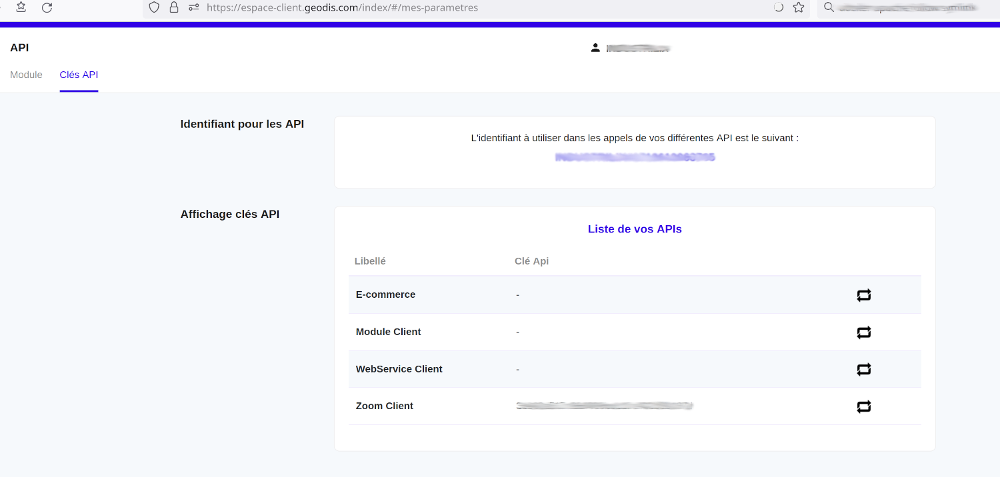

# Module GEODIS pour [DOLIBARR ERP & CRM](https://www.dolibarr.org)

## Paramétrage

Ce module permet la récupération et l'actualisation à intervalles réguliers des informations concernant les expéditions
effectuées via Geodis (Url de tracking, date de livraison, détails sur l'expédition)

Il faut faire activer par votre service client Geodis l'API Zoom dans votre espace

Les seuls paramétrages dans le setup de ce module à saisir sont l'identifiant API et la clé API Zoom Client

Ensuite, à condition que les tâches planifiées soient activées et correctement appelées 
(voir Outils d'adminstration->travaux planifiés et docs de ce module)
l'appel au service Geodis Zoom s'effectuera automatiquement toutes les heures

A noter que ce module a été testé sur les versions Dolibarr suivantes : 21, 18 et 16

## Utilisation

Il suffit lors de la création de l'expédition chez Geodis (via leur portail https://espace-client.geodis.com) de mettre en référence l
de saisir dans Référence #1 et/ou Référence #2 la(les) ref(s) des l'expédition(s) concernée(s) type SHyymm-xxxx

Il est possible de saisir 2 refs d'exped dans Référence #1 et Référence #2

Mais aussi de saisir plusieurs refs d'expéd. Dolibarr dans les Ref Geodis sous la forme SHyymm-xxxx-yyyy-zzzz etc
dans ce cas les expéditions SHyymm-xxxx, SHyymm-yyyy, et SHyymm-zzzz seront mises à jour

Le module via les tâches planifiées ira toutes les heures 
- mettre à jour le transporteur si besoin
- récupérer le lien de suivi, l'état de l'expédition et les détails, ce dans les champs additionnels 
"extrafields" **Date expéd. Geodis**, **Statut expéd. Geodis**, **Détails expéd. Geodis**

Si l'expédition passe à "livrée" chez Geodis, le statut de l'expédition Dolibarr passe à "traitée"

A noter que le module Geodis lors de son installation 
- crée ou met à jour la méthode d'expédition Geodis
- crée les champs additionnels 
"extrafields" **Date expéd. Geodis**, **Statut expéd. Geodis**, **Détails expéd. Geodis** dans les expéditions

<!--
{imgmd}
-->

D'autres modules sont disponibles sur [Dolistore.com](https://www.dolistore.com).

## Translations

Ce module n'est pour l'instant disponible qu'en Français
